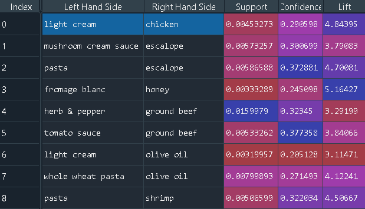

# Association-Rule-Learning

Implementation of Association rule learning using Apriori and Eclat.
Association rule learning is a type of unsupervised learning technique that checks for the dependency of one data item on another data item and maps accordingly so that it can be more profitable. It tries to find some interesting relations or associations among the variables of the dataset. It is based on different rules to discover the interesting relations between variables in the database.
___

# Installations 

```python
pip install numpy 
pip install pandas
pip install apyori
```

___

# Table of Contents   
| S.N 	| Association Learning Algorithm 	| Dataset Used                   	|
|-----	|--------------------------------	|--------------------------------	|
| 1.  	| Apriori                        	| Market_Basket_Optimisation.csv 	|
| 2.  	| Eclat                          	| Market_Basket_Optimisation.csv 	||   

___


## Apriori Algortihm

The Apriori algorithm uses frequent itemsets to generate association rules, and it is designed to work on the databases that contain transactions. With the help of these association rule, it determines how strongly or how weakly two objects are connected. This algorithm uses a breadth-first search and Hash Tree to calculate the itemset associations efficiently. It is the iterative process for finding the frequent itemsets from the large dataset.   

**Process**   
**Step 1:** Set a minimum support and confidence.   
**Step 2:** Take all the subsets in transaction having higher support than the minimum support.   
**Step 3:** Take all the rules of these subsets having higher confidence than minimum confidence.   
**Step 4:** Sort the rules by decreasing lift.    

### **Steps Involved:**   

1. Importing the libraries.
2. Data Preprocessing.
3. Training the Apriori model on dataset.
4. Visualising the result. 
5. Putting the results well organized into a Pandas DataFrame.
6. Displaying the sorted result in the descending order.

___ 

### Observation: 
The association rules generated and sorted in descending order according to theirs lifts:   

 
___
___
 